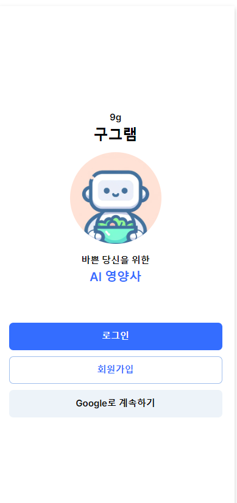
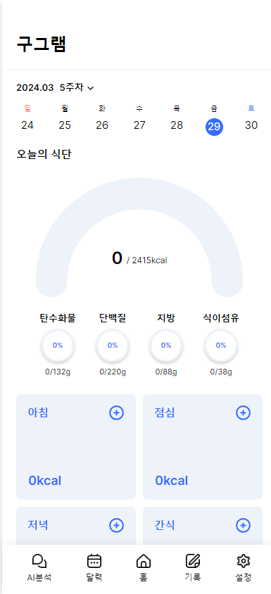
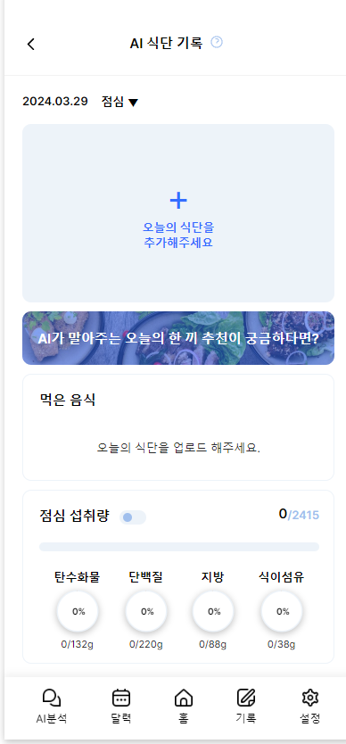
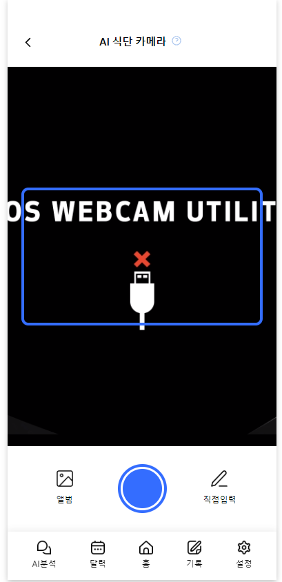
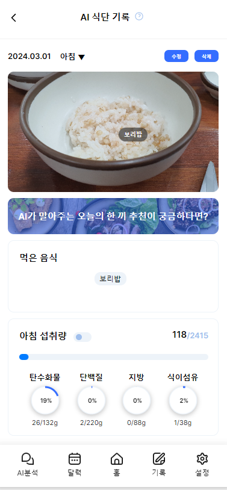
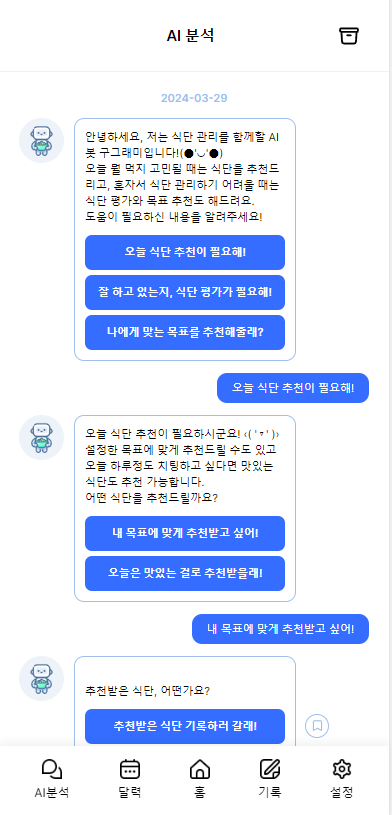
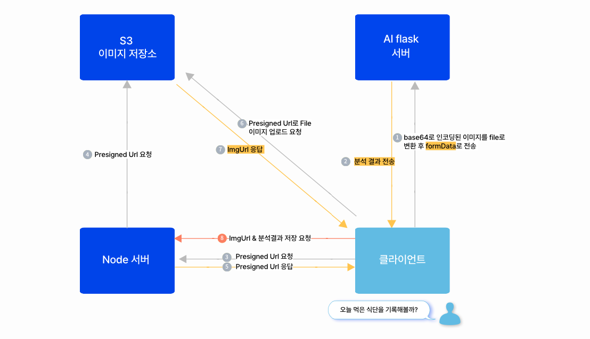
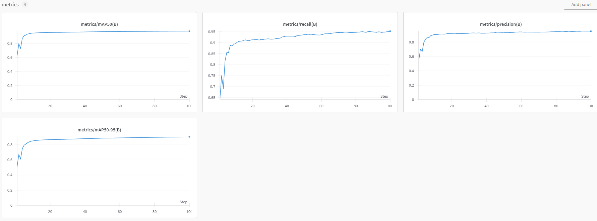

# Gugram: 이미지 처리 인공지능을 활용한 식단기록 서비스

🚀 [**gugram 앱으로 바로가기**](https://gugram.xyz/auth)

test 계정 :
ID: elicetest1@elice.com
PW: Kk12345678!

ID: elicetest2@elice.com
PW: Kk12345678!

ID: elicetest3@elice.com
PW: Kk12345678!

### **목차** 

[1. 프로젝트 소개](#1-프로젝트-소개) 
[2. 프로젝트 사용 도구와 데이터](#2-프로젝트-사용-도구와-데이터) 
[3. 프로젝트 기능 소개 ](#3-프로젝트-기능-설명) 
[4. 프로젝트 구조](#4-프로젝트-구조) 
[5. 프로젝트 AI 성능 지표 및 모델](#5-프로젝트-AI-성능-지표-및-모델) 

 

## 1. 프로젝트 소개

### **Gugram** 

### 이미지 처리 인공지능을 활용한 식단기록 서비스

| 차별화 기능 1 | 이미지 처리 모델로 사진속 음식의 이름을 추론하여 그 결과를 기록                       |
| ------------- | ------------------------------------------------------------------------------------- |
| 차별화 기능 2 | OPEN AI API를 활용하여 사용자의 식단 데이터를 바탕으로 식단 분석을 Chat GPT4.0에 요청 |

 

## 2. 프로젝트 사용 도구와 데이터

### 사용 도구 및 데이터  

- AI  
  
  

- Front-end  
       

- Back-end  
        
- Deploy  
      

- Datas   음식 이미지 및 영양정보 텍스트 : https://www.aihub.or.kr/aihubdata/data/view.do?currMenu=&topMenu=&aihubDataSe=data&dataSetSn=74  --> 이미지 처리 모델 학습에 사용   식품의약품안전처 식품영양성분 API : https://various.foodsafetykorea.go.kr/nutrient/   --> 음식 영양성분 데이터로 사용   

 

## 3. 프로젝트 기능 설명

<table>
  <thead>
    <tr>
      <th>1. 회원가입 & 로그인 페이지</th>
      <th>2. 메인페이지</th>
    </tr>
  </thead>
  <tbody>
    <tr  style="font-size:12px">
      <td>로컬로그인과 구글로그인으로 서비스를 이용할 수 있습니다.</td>
      <td>홈 화면에서는 하루섭취 정보를 볼 수 있습니다.</td>
    </tr>
    <tr>
      <td></td>
      <td></td>
    </tr>
  </tbody>
</table>

<table>
  <thead>
    <tr>
      <th>3. 식단 기록 페이지</th>
      <th></th>
      <th></th>
      <th></th>
    </tr>
  </thead>
  <tbody>
    <tr style="font-size:12px">
      <td>아침,점심,저녁,간식을 선택하여 기록할 수 있습니다.</td>
      <td>아침,점심,저녁,간식 중 택1하면 기록페이지로 넘어갑니다.</td>
      <td>"촬영 기능" 으로 음식 사진을 업로드 할 수 있습니다.</td>
      <td>"이미지 업로드 기능" 으로 음식 사진을 업로드 할 수 있습니다.</td>
    </tr>
    <tr style="font-size:12px">
      <td>사진 업로드 후 분석요청시 AI서버에 사진 분석이 요청됩니다.</td>
      <td>분석이 끝난 뒤에 분석결과가 나타납니다.</td>
      <td>분석이 끝난 뒤에 분석결과를 선택하여 수정할 수 있습니다.</td>
      <td>수정을 마치면, 식단 기록이 완료됩니다.</td>
    </tr>
    <tr>
      <td></td>
      <td></td>
      <td></td>
    </tr>
  </tbody>
</table>

<table>
  <thead>
    <tr>
      <th>4. AI영양사 페이지</th>
    </tr>
  </thead>
  <tbody>
    <tr style="font-size:12px">
      <td>OPEN AI API를 사용하여 chat gpt에게 식단분석을 요청할 수 있습니다.</td>
    </tr>
    <tr>
      <td>  </td>
    </tr>
  </tbody>
</table>

 

## 4. 프로젝트 구조

 

## 5. 프로젝트 AI 성능 지표 및 모델

[**wandb**](https://wandb.ai/cbj0328/foodyolo/runs/910uaaqb?nw=nwusercbj0328)
 
[**huggingface**](https://huggingface.co/hiddenbebb/9gram_food)

 
